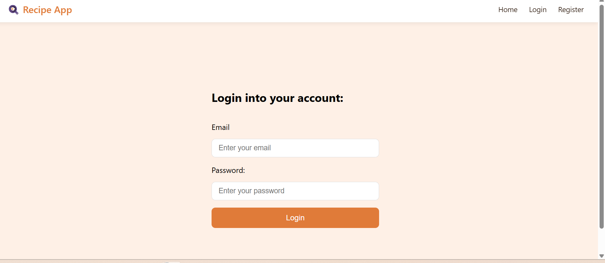
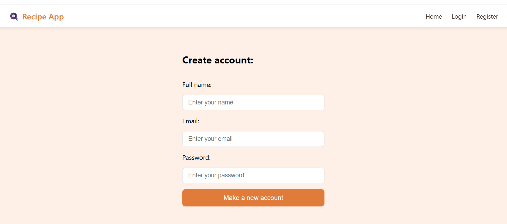
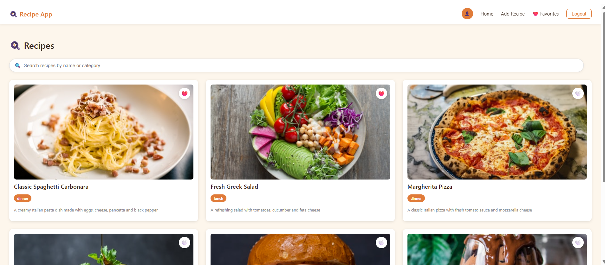
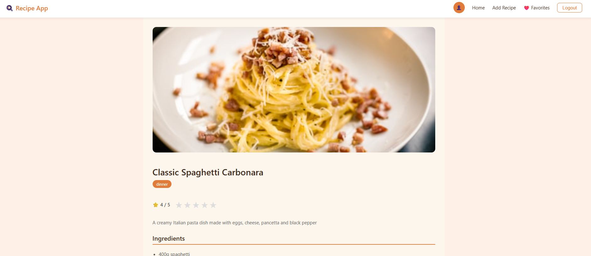
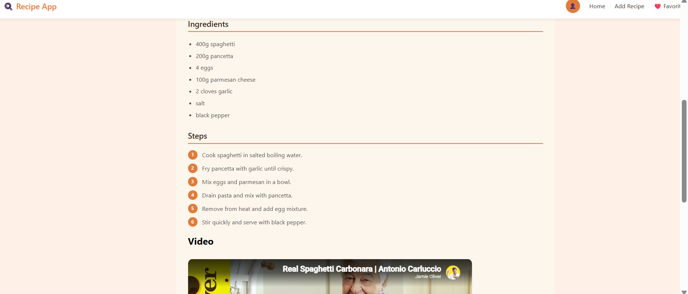
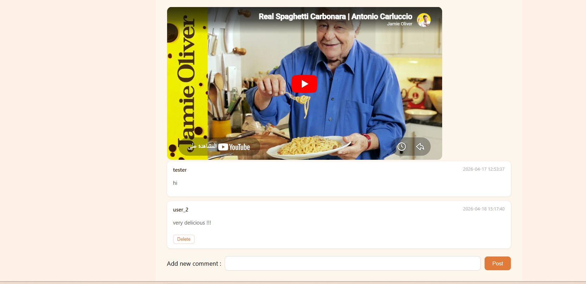
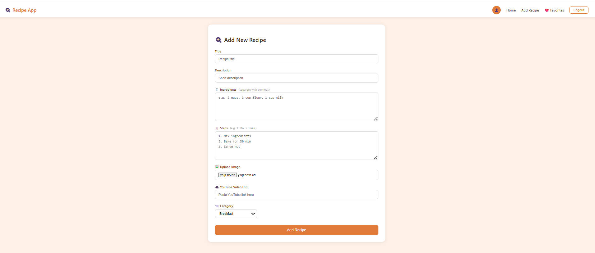
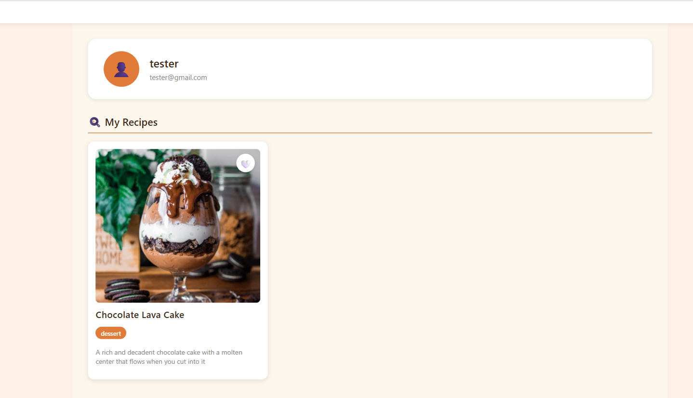
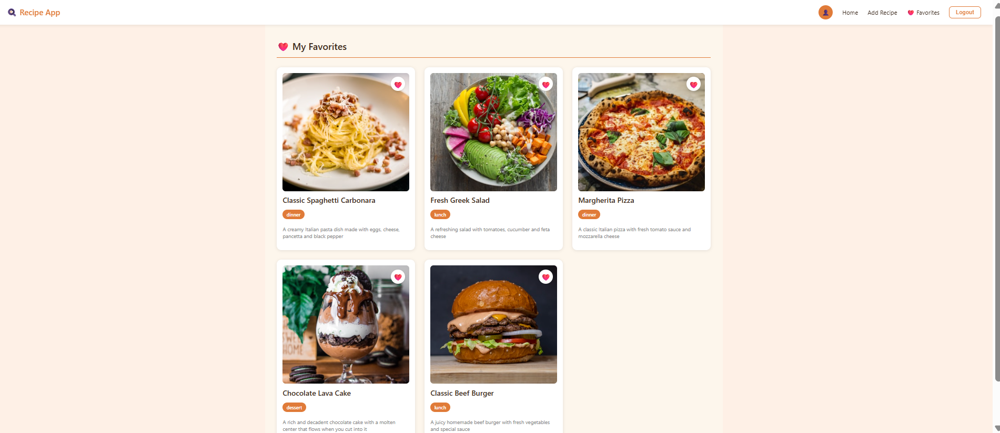

# 🍳 Recipe App — Frontend

A React web application for a recipe sharing community platform.

## What is this project?

A food community website where anyone can browse recipes, and registered users can share their own recipes, save favorites, rate dishes, and leave comments — like Instagram but for food!

## Tech Stack

- **React** — frontend framework
- **JavaScript** — programming language
- **HTML** — page structure
- **CSS** — styling and design
- **Axios** — HTTP requests to the backend API
- **React Router DOM** — page navigation between routes

## Features

- Browse all recipes in a beautiful grid
- Search recipes by name or category
- View full recipe details with ingredients, steps and YouTube video
- Register and login with JWT authentication
- Add your own recipes with photo upload
- Save/unsave favorite recipes with heart button
- Rate recipes with star rating (1-5 stars)
- Add and delete comments
- Profile page with your recipes
- Favorites page with saved recipes
- Responsive navbar with login/logout

## Pages

| Page | Path | Description |
|------|------|-------------|
| Home | / | Browse all recipes with search |
| Recipe Detail | /recipes/:id | Full recipe page |
| Add Recipe | /add-recipe | Add a new recipe |
| Profile | /profile | Your recipes |
| Favorites | /favorites | Saved recipes |
| Login | /login | Login page |
| Register | /register | Register page |

## How to Run Locally

**1. Clone the repository:**
```bash
git clone https://github.com/yamandahle/recipe-app-frontend.git
cd recipe-app-frontend
```

**2. Install dependencies:**
```bash
npm install
```

**3. Make sure the backend is running on:**
```
http://127.0.0.1:8000
```

**4. Start the app:**
```bash
npm start
```

**5. Open in browser:**
```
http://localhost:3000
```

## Project Structure

```
src/
├── pages/
│   ├── Home.js          → Recipe grid with search
│   ├── RecipePage.js    → Recipe detail page
│   ├── AddRecipe.js     → Add recipe form
│   ├── Profile.js       → User profile page
│   ├── Favorite.js      → Saved recipes page
│   ├── Login.js         → Login page
│   └── Register.js      → Register page
├── components/
│   ├── Navbar.js        → Navigation bar
│   ├── RecipeCard.js    → Recipe card component
│   └── Comment.js       → Comment component
└── App.js               → Routes configuration


## Screenshots

### 🔐 Login page


### 📝 Registration page


### 🏠 Home Page


### 🍳 Recipe Detail




### ➕ Add Recipe


### 👤 Profile


### ❤️ Favorites
